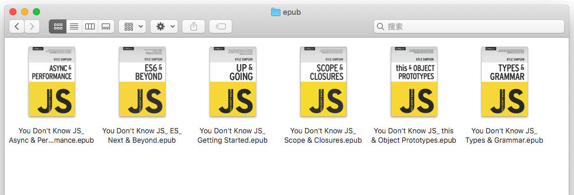

# you-dont-know-js-epub
"You Don't Know JS Yet" (1st/2nd editions) ePub generator.

- Original book series by Kyle Simpson:
[2nd Edition](https://github.com/getify/You-Dont-Know-JS/tree/2nd-ed) (in progress) and [1st Edition](https://github.com/getify/You-Dont-Know-JS/blob/1st-ed/README.md).

- Inspired by gist:
[bmaupin/6e3649af73120fac2b6907169632be2c](https://gist.github.com/bmaupin/6e3649af73120fac2b6907169632be2c)

## Generate the ePub

Run with Docker:

```sh
docker run --rm -it -v $PWD/output:/root/output gongzhang/ydkjs-epub
```

Then the generated epub files are in `output` folder: 



## Customization

First, recursively clone this repo to your machine:

```sh
git clone --recursive git@github.com:gongzhang/you-dont-know-js-epub.git
```

Then you can:
- Modify `epub.css` to customize the style.
- Read `gen.sh` to understand how the generator works.
- Fetch the latest book content using git submodule command under `1st-edition` and `2nd-edition` directory.

Finally, rebuild the Docker image and generate epub files:

```sh
docker build -t ydkjs-epub .
docker run --rm -it -v $PWD/output:/root/output ydkjs-epub
```

## Known Issues & TODOs

- Does support syntax highlighing
